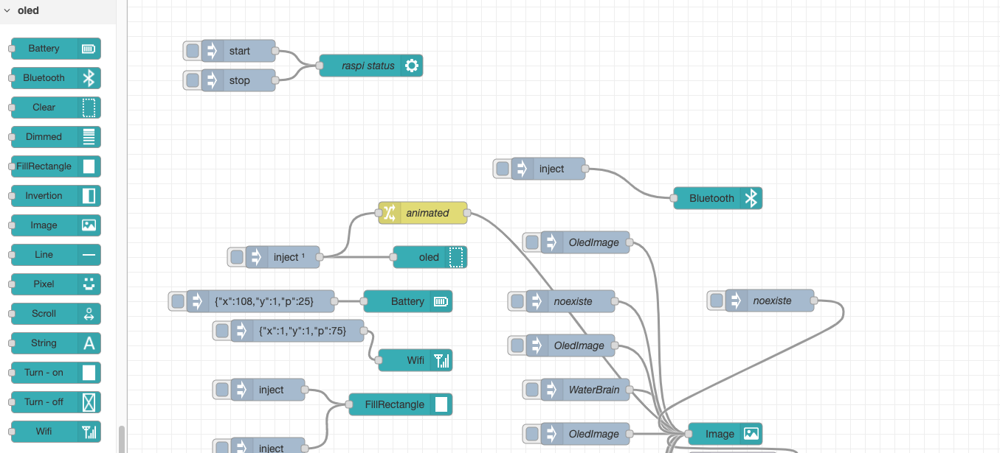
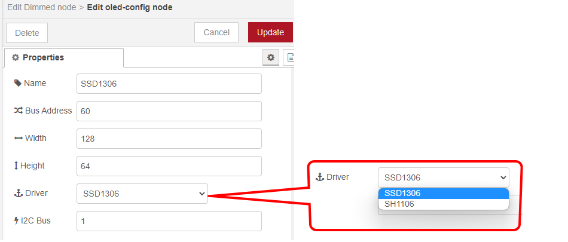

node-red-contrib-oled-i2c
=========================
Forked from https://www.npmjs.com/package/node-red-contrib-oled  
  



Node-Red node to talk to OLED displays, connected by i2c.

# Usage

Configure the OLED as shown:  
  


Note that Raspberry Pi allows you to enable software I2C which is useful for device that requires `I2C clock stretching`. `SH1106` might give `Error: RemoteIO error` in some cases. This can be solved by using software I2C.

To enable software I2C:
* Edit `/boot/config.txt`
* Add the following directive anywhere in the file:

```
dtoverlay=i2c-gpio,bus=3
```
* The SDA is on pin `GPIO 23 / BCM 16`
* The SCK in on pin `GPIO 24 / BCM 18`
* The software I2C is on **`Bus 3`**

# Features

* Perfectly compatible with Raspberry Pi 4B/3B+/3B.
* In the examples/Example1 directory there is a flow that you can use for testing.
* Support OLED display, which can display the running status of Raspberry Pi in real-time or anything you want.
    * SSD1306
        - all features
    * SH1106
        - `Scroll` feature is not available (no native support)
* Support various font from `oled-font-pack` package.  

# Please Contact Us
If you have any problem when using our package, please contact us..
